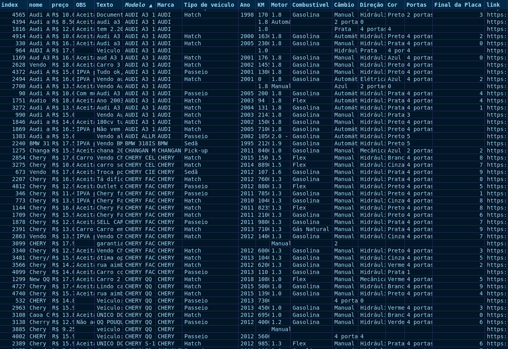

# João Pedro Stuart - Work collection
-- Portfolio of my WIP and finished projects.

# Project 1) [Clustering Analysis to balance player skills of a generic cellphone game](https://github.com/jstuartpieri/players_skill_cluster_analysis)

his case was proposed by iClinic. Objective was to: Having 3 datasets (players, matches and goals) analyze those and find a way to gather in groups players with simillar skill level from a generic cellphone game in order to balance the level of the matches.

* Used their API to get players data.
* Used SQL (postgres) to extract Matches and Goals tables.
* Data processing and wrangling to prepare data to be ingested in the cluster model.
* Dendrogram Analysis
* Agglomerative cluster -- using 6 clusters to split players (used wins and defeat features to cluster ensembling).

# Project 2) [Buying a used car - Scrapping and Analyzing OLX car's data](https://github.com/jstuartpieri/scrapping_carros_olx)

I wanted to buy a new car so I decided to scrape OLX plataform which contain multiple ads from people wanting to sell their cars. A simple preprocessing was done in order to: clean some bad formated data and add some other filterings. Processed dataset was exported to a csv file and excel was used to do the final checkings and explore possible good car ads, offers.

* Scrapy framework used along with Python to scrape car's data from OLX site.
* Pre-processing to correct some bad formatted data and delete some missing values rows.
* Wrangling data to met some chosen criterias and exported to a csv file.
* Analyzed the data using excel to choose potential good offers.

# Project 3) AWS truepower API wind characterists batch run extraction, processing and Analyssis

AWS Truepower holds a database with huge amount of wind related characteristics measures in a global scope. This exercise was done to extract some wanted sites wind characteristics that were used by marketing team to find sites with Tier 1 wind conditions.

This project was done to marketing intelligence GE Renewable Energy team and it's confidential, so code and image previas can not be disclosed.

* AWS truepower API wind characteristics extraction in monthly scope using theirs API -- was used Python to batch run several sites at once -- text file used to store params needed to include as headers in POST method (used to feed batch run inputs).
* Data processing and data wrangling to prepare data to be ingested in Tableau along many other internal datasets.
* Tableau ensembling to give a global viz of wind onshore characteristics using AWS truepower wind data.

# Project 4) LATAM onshore wind Marketing Analysis (Tableau vizualization)

* Using multiple datasets some API extracted others GE internal was created an interative dashboard to  provide vizualization  covering LATAM onshore wind marketing analytics.
* Covered analytics were:
  * Prospect and wind resources, Region Overview, Competitive Landscape, Customer Overview, OEM Selection, Turbines Selection.
  
 

# Project 5) MongoDB localhost configuration to store scrapped rotten tomatoes movies data

* Scrapped Rotten Tomatoes data and exported in JSON format.
* Configurated a localhost MongoDB server using 2 shards, each with 3 replicasets to store data extracted.
* Imported rotten tomatoes JSON formatted extracted data to MongoDB shards.

# Project 6) Classifier to predict wind profiles using load sensors

WIP, EDA - September 15th.

# Project 7) Regressor to predict wind shear values

WIP, EDA - September 15th.
